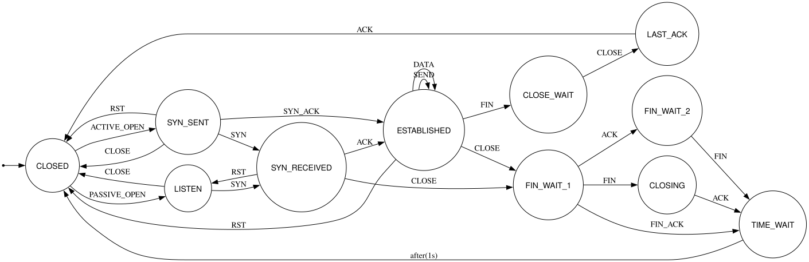
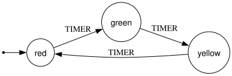
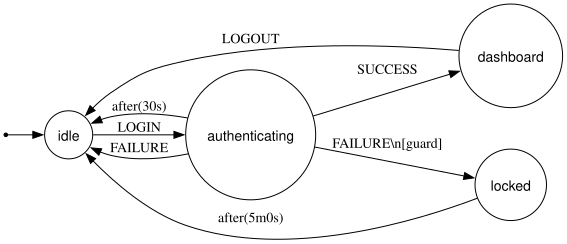
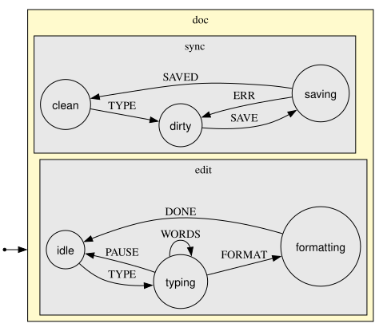

# [statecraft](https://app.devin.ai/org/sarahishamsaied/wiki/sarahishamsaied/statecraft)

A concurrency-first statechart runtime for Go.

[statecraft](https://app.devin.ai/org/sarahishamsaied/wiki/sarahishamsaied/statecraft)
 lets you model complex application logic as hierarchical state machines ---> with compound states, parallel regions, guarded transitions, async invocations, actor supervision, and JSON persistence ---> all in idiomatic Go with no external dependencies.

```go
m := statecraft.New[TrafficCtx]("traffic-light").
    Initial("red").
    State("red",    func(s *statecraft.StateBuilder[TrafficCtx]) { s.On("TIMER", "green") }).
    State("green",  func(s *statecraft.StateBuilder[TrafficCtx]) { s.On("TIMER", "yellow") }).
    State("yellow", func(s *statecraft.StateBuilder[TrafficCtx]) { s.On("TIMER", "red") }).
    MustBuild()

svc := statecraft.Start(m)
defer svc.Stop()
svc.Send(statecraft.E("TIMER"))
fmt.Println(svc.State()) // "green"
```

## Features

- **Flat, compound, and parallel states** ---> OR and AND regions, event bubbling, LCCA-based exit/entry
- **Done events** ---> `s.OnDone("next")` fires automatically when a compound/parallel state completes
- **Delayed transitions** ---> `s.After(500*time.Millisecond, "timeout")`
- **Async invocations** ---> long-running side effects scoped to a state's lifetime
- **Actor system** ---> named actors with supervision strategies (NoRestart, RestartAlways, RestartN)
- **Persistence** ---> `Save` / `Restore` across process restarts via JSON checkpoints
- **Visualization** ---> Mermaid and Graphviz diagrams from any compiled machine
- **Testkit** ---> synchronous harness for deterministic unit tests, no goroutines needed

# Formal Automata Mapping

Classical finite automaton: **( Q, Σ, δ, q0, F )**

| Symbol | Meaning | statecraft |
|--------|---------|-----------|
| Q | set of all states | `machine.StateIDs()` |
| Σ | alphabet, all valid input symbols (events) | `machine.Transitions()` → `.Event` fields |
| δ | transition function | `machine.ResolveTransition(state, ctx, event)` |
| q0 | initial state | `machine.InitialLeaves()` |
| F | set of accepting / final states | states where `machine.IsFinal(id) == true` |
| δ(q, σ)  ->  q' | given state + event, returns next state | `target, actions, ok := machine.ResolveTransition(q, ctx, σ)` |

## Where statecraft extends the classical model

| Extension | Why | statecraft |
|-----------|-----|-----------|
| δ(q, **C**, σ) -> q' | transitions can be guarded by context | `GuardFn[C]` on each transition |
| q is a **set** of leaves | parallel regions mean multiple active states | `service.Snapshot().Leaves` |
| Σ includes synthetic events | timers and done events are auto-generated | `statecraft.after.*`, `done.state.*` |
| Q is hierarchical | compound/parallel states nest | `machine.Parent(id)`, `machine.Children(id)` |


## Examples

### TCP connection (RFC 793)

The full TCP state machine from the spec: 11 states, 10 event types, sequence numbers in context.
`TIME_WAIT` uses `s.After(2*MSL, "CLOSED")` matching the RFC verbatim.
Three `Invoke` callbacks simulate the remote peer, so the machine drives itself through handshake, data transfer, and four-way teardown.

[Full walkthrough](docs/tcp-example.md)

```
go run ./examples/tcp
```

```
── three-way handshake ──────────────────────────────
  → SYN       seq=7823
  ← SYN,ACK   seq=0      ack=7824
  → ACK       seq=7824   ack=1
SYN_SENT       → ESTABLISHED

── data transfer ────────────────────────────────────
  → DATA      seq=7825   len=12
  ← DATA      seq=1      len=12

── four-way teardown ────────────────────────────────
  → FIN       seq=7837   ack=13
ESTABLISHED    → FIN_WAIT_1
  ← ACK       seq=13     ack=7838
FIN_WAIT_1     → FIN_WAIT_2
  ← FIN       seq=14     ack=7838
  → ACK       seq=7838   ack=15
FIN_WAIT_2     → TIME_WAIT
TIME_WAIT      → CLOSED
```



### Other examples

```bash
go run ./examples/trafficlight  # flat FSM
go run ./examples/authflow      # guards + timeouts + final state
go run ./examples/doceditor     # parallel regions + OnDone
go run ./examples/eightpuzzle   # Extended FA: 181k board configs, 3 control states
```

## Diagrams

**Traffic light** , flat FSM



**Auth flow** , guards, delayed transitions, final state



**Doc editor** , parallel regions, OnDone



> Regenerate with `go run ./cmd/viz` (requires `graphviz`: `brew install graphviz`)

## Quick start

```bash
go test ./...
go run ./examples/tcp
go run ./cmd/viz   # regenerate SVG diagrams → docs/diagrams/
```

## Prior art & research

statecraft stands on the shoulders of these works:

| Paper | What it contributes |
|-------|-------------------|
| Harel, D. ---> *Statecharts: A Visual Formalism for Complex Systems* (1987) | The core model: hierarchy, orthogonality, history, broadcast events |
| Harel & Pnueli ---> *On the Development of Reactive Systems* (1985) | Defines reactive systems and why statecharts are the right tool |
| W3C ---> *SCXML: State Machine Notation for Control Abstraction* (2015) | The normative macrostep algorithm statecraft implements |
| Hewitt, Bishop & Steiger ---> *A Universal Modular ACTOR Formalism* (1973) | Actor model: private mailbox, async message passing |
| Agha, G. ---> *Actors: A Model of Concurrent Computation* (1985) | Formal actor semantics: mail queues, behavior replacement |
| Armstrong, J. ---> *Making Reliable Distributed Systems* (2003) | Erlang/OTP supervision trees and let-it-crash philosophy |
 
more on this: [check out devin docs](https://app.devin.ai/org/sarahishamsaied/wiki/sarahishamsaied/statecraft)


